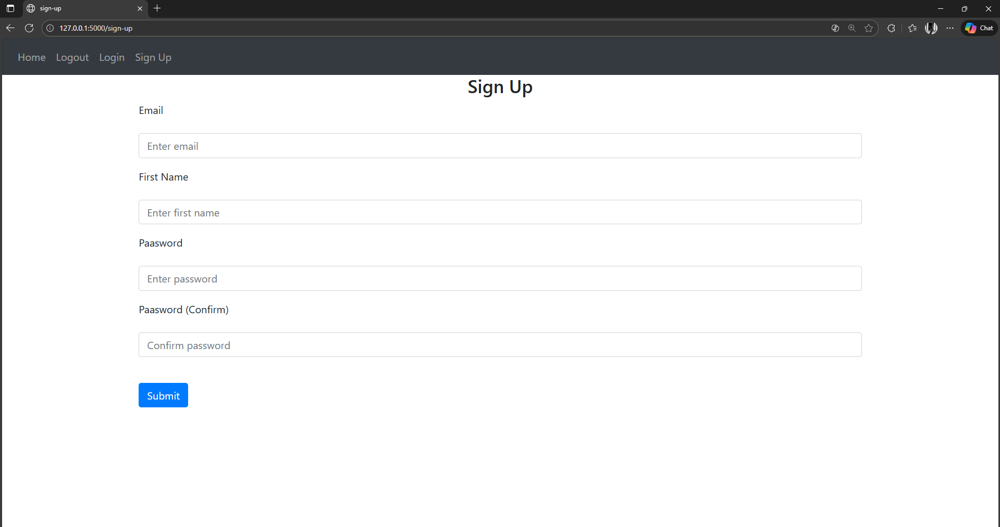

# Phase 1 — Initial Project Structure & UI Setup

This phase contains the foundational structure of the Flask web application along with the basic UI pages (Home, Login, Signup). It sets up the overall layout, navigation, and file organization that the later phases will build on.

---

## 📌 Overview

Phase 1 focuses on:
- Creating the Flask project folder structure  
- Setting up routing placeholders  
- Designing basic HTML templates  
- Building the signup, login, and home UI  
- Adding a reusable base layout using Bootstrap  
- Preparing files for future backend logic (auth, models, views)

This phase is UI-first — no database or backend authentication logic is implemented yet.

---

## 📁 Project Structure (Phase 1)

project/
│ main.py
│
└───website/
│ init.py
│ auth.py
│ model.py
│ views.py
│
├── static/
│ └── index.js
│
└── templates/
├── base.html
├── home.html
├── login.html
└── sign-up.html


**Key elements:**
- `main.py` → Flask app entry point  
- `website/__init__.py` → initializes the app package  
- `auth.py` → routes for login & signup (logic to be added in Phase 2)  
- `views.py` → home page route  
- `templates/` → all HTML pages  
- `static/` → JS/CSS for future use  

---

## 🖼 UI Included in Phase 1

### **Signup Page (UI Only)**
- Email
- First Name
- Password
- Confirm Password
- Submit button  
All fields styled using Bootstrap.

### **Navigation Bar**
- Home  
- Login  
- Signup  
- Logout (placeholder)

---
## 🖼 Screenshot (Phase 1)




## ▶️ How to Run (Phase 1)

1. Install Flask
   ```bash
   pip install flask
